## การเลือกใช้ map style

ในการเลือกใช้ style ของ map ให้กำหนด option style ในตอนสร้าง map แล้วใส่ชื่อ style ที่ต้องการ

```javascript
const map = new mapmagic.Map({
  container: 'map',
  app_id: '<YOUR_APP_ID>',
  api_key: '<YOUR_API_KEY>',
  style: '<MAP_STYLE>', 
});

```
## รายชื่อ Map Styles
- [Almond](#almond)
- [Cha thai](#cha-thai)
- [Charcoal](#charcoal)
- [Cloudy](#cloudy)
- [Hybrid](#hybrid)
- [Ivory](#ivory)
- [Lightsteel](#lightsteel)
- [Midnight](#midnight)
- [Satellite](#satellite)
- [Spearmint](#spearmint)
- [Terrain](#terrain)

## ตัวอย่าง map style

### Almond
```javascript
const map = new mapmagic.Map({
  container: 'map',
  app_id: '<YOUR_APP_ID>',
  api_key: '<YOUR_API_KEY>',
  style: 'almond',
});

```
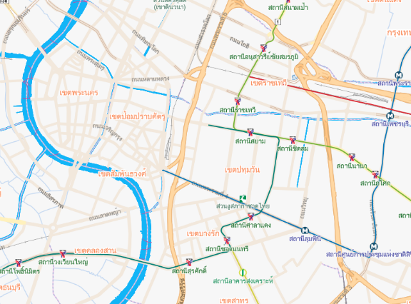

### Cha-Thai
```javascript
const map = new mapmagic.Map({
  container: 'map',
  app_id: '<YOUR_APP_ID>',
  api_key: '<YOUR_API_KEY>',
  style: 'cha-thai',
});

```
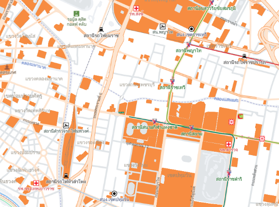

### Charcoal
```javascript
const map = new mapmagic.Map({
  container: 'map',
  app_id: '<YOUR_APP_ID>',
  api_key: '<YOUR_API_KEY>',
  style: 'charcoal',
});

```


### Cloudy
```javascript
const map = new mapmagic.Map({
  container: 'map',
  app_id: '<YOUR_APP_ID>',
  api_key: '<YOUR_API_KEY>',
  style: 'cloudy',
});

```
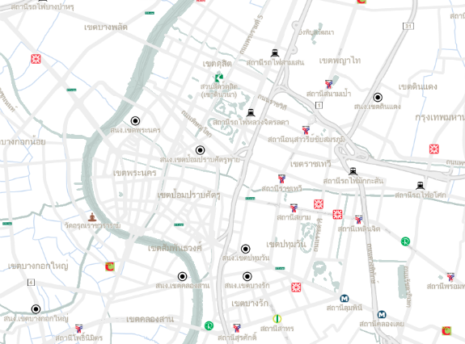

### Hybrid
```javascript
const map = new mapmagic.Map({
  container: 'map',
  app_id: '<YOUR_APP_ID>',
  api_key: '<YOUR_API_KEY>',
  style: 'hybrid',
});

```
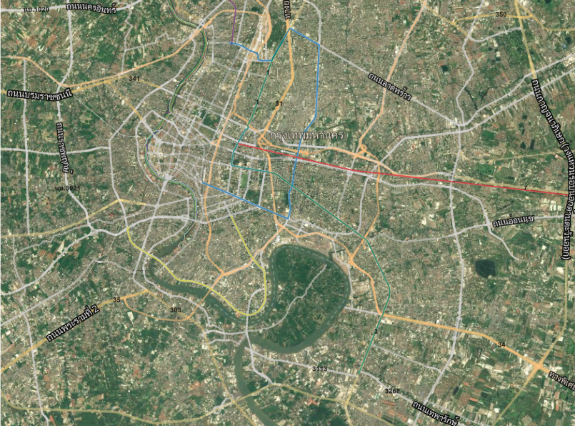

### Ivory
```javascript
const map = new mapmagic.Map({
  container: 'map',
  app_id: '<YOUR_APP_ID>',
  api_key: '<YOUR_API_KEY>',
  style: 'ivory',
});

```
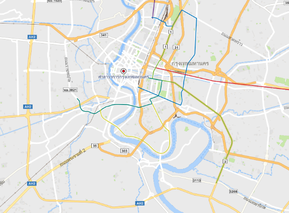

### LightSteel
```javascript
const map = new mapmagic.Map({
  container: 'map',
  app_id: '<YOUR_APP_ID>',
  api_key: '<YOUR_API_KEY>',
  style: 'lightsteel',
});

```
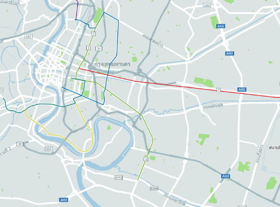

### Midnight
```javascript
const map = new mapmagic.Map({
  container: 'map',
  app_id: '<YOUR_APP_ID>',
  api_key: '<YOUR_API_KEY>',
  style: 'midnight',
});

```
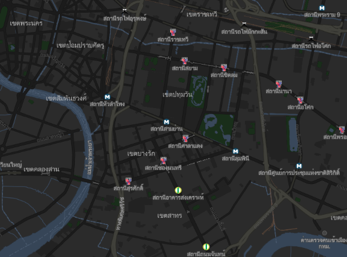

### Satellite
```javascript
const map = new mapmagic.Map({
  container: 'map',
  app_id: '<YOUR_APP_ID>',
  api_key: '<YOUR_API_KEY>',
  style: 'satellite',
});

```
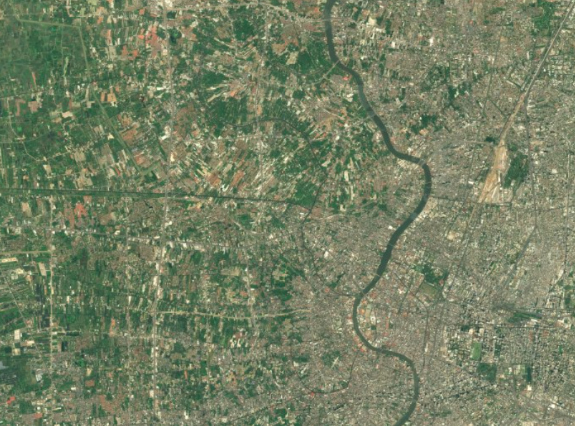

### Spearmint
```javascript
const map = new mapmagic.Map({
  container: 'map',
  app_id: '<YOUR_APP_ID>',
  api_key: '<YOUR_API_KEY>',
  style: 'spearmint',
});

```
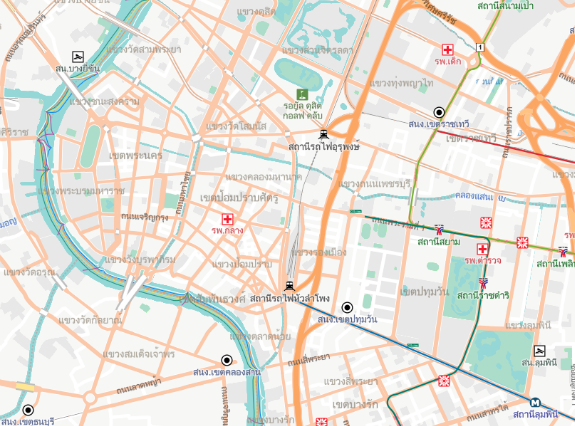

### Terrain
```javascript
const map = new mapmagic.Map({
  container: 'map',
  app_id: '<YOUR_APP_ID>',
  api_key: '<YOUR_API_KEY>',
  style: 'terrain',
});

```
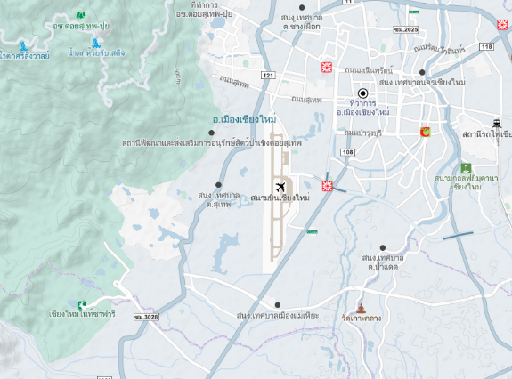

## การกำหนดการแสดงภาษาบนแผนที่

ในการกำหนดการแสดงภาษาบนแผนที่ ให้กำหนด option lang ในตอนสร้าง map แล้วใส่อักษรย่อ ภาษา ที่ต้องการ ซึ่งในตอนนี้ map style รองรับภาษา ไทย อังกฤษ และ ไทย-อังกฤษ

| ภาษา | key ที่ใช้ |
|------|---------|
|  ไทย (default)|  th |
| อังกฤษ |  en |
| ไทย-อังกฤษ |  th-en |

### ตัวอย่าง การเรียกใช้ภาษา ไทย อังกฤษ
```javascript
const map = new mapmagic.Map({
  container: 'map',
  app_id: '<YOUR_APP_ID>',
  api_key: '<YOUR_API_KEY>',
  style: '<MAP_STYLE>',
  lang: 'th-en',
});

```
### การแสดงผล

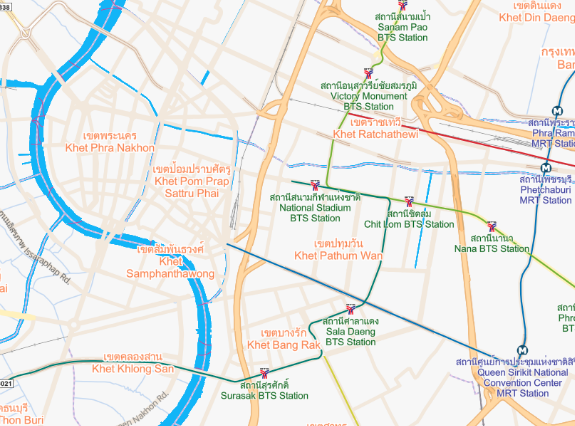
