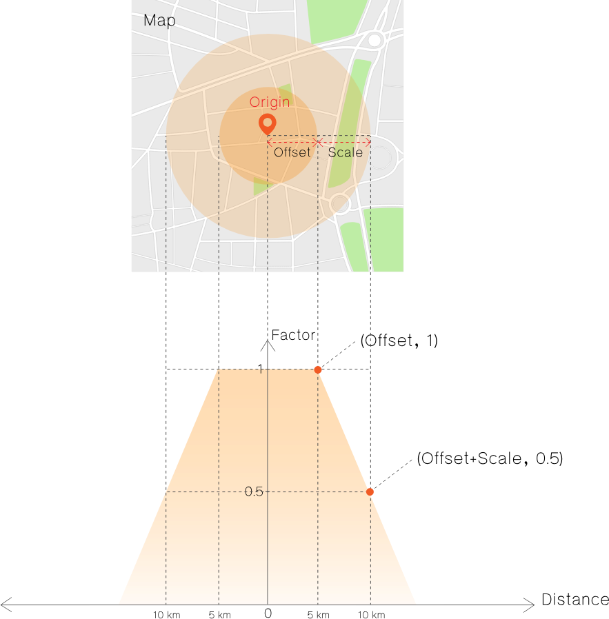

# Nearby Search Algorithm

คือ กระบวนการคิดคำนวณ Score ตามระยะห่างจากจุดที่สนใจ(Origin) โดย Score ที่ได้จะมีค่ามากเมื่ออยู่ใกล้จุดที่สนใจ และจะลดลงตามระยะที่ห่างออกไป เพื่อใช้ในการเรียงลำดับผลลัพธ์ที่ได้จากการค้นหา

หลักการคิด Score มี 3 ขั้นตอนตามลำดับ ดังนี้

## หลักการคำนวณ Score

1. `Score` มาจากคะแนนสองส่วนคือ  `Matching Score` และ `Factor`
    * `Matching Score` คือคะแนนที่บ่งบอกความใกล้เคียงของข้อมูลที่มี กับ Keyword ที่ต้องการค้นหา
        - Keyword คือ คำที่ผู้ใช้ต้องการค้นหา โดยถูกนำไปเข้ากระบวนการตัดคำก่อนที่จะนำไปเทียบกับข้อมูลทั้งหมดที่ผู้ใช้มี
            > เช่น Keyword: "โรงพยาบาล" จะถูกนำไปตัดคำออกเป็น "โรง", "พยาบาล" แล้วจึงนำสองคำนี้ไปเทียบกับข้อมูลที่มีต่อไป
    * `Factor`(มีค่าตั้งแต่ 0 ถึง 1) หาจากค่าความชันของ `Offset` และ `Scale` ตามระบบสมการเส้นตรง(Linear Function) ดังรูป **[Figure 1.0]**
   

<em>
<b>Figure 1.0</b> กราฟแสดงการคำนวณค่า Factor
</em>

<i><u>อธิบายเพิ่มเติมจากรูป <b>Figure 1.0</b></u></i>

<i>
<ul style="list-style-type:square font-size:15px;">
    <li><b>Origin</b>: ตำแหน่งของจุดที่สนใจ(lat, lng)</li>
    <li><b>Offset</b>: ค่ารัศมีของพื้นที่ที่ห่างจากจุด <code>Origin</code> มีหน่วยเป็น km โดยสิ่งที่อยู่ในพื้นที่นี้จะมีค่า <code>Factor</code> เป็น 1 เสมอ</li>
    <li><b>Scale</b>: (ต้องมีค่ามากกว่า 0): รัศมีของพื้นที่วงนอกโดยนับจากระยะห่างจากขอบของพื้นที่ <code>Offset</code> มีหน่วยเป็น km ค่า <code>Factor</code> จะเริ่มลดลงตามระยะที่ออกห่างจากขอบของพื้นที่ <code>Offset</code> และจะมีค่าเท่ากับ 0.5 ที่ขอบของ <code>Scale</code> เสมอ</li>
    <li>ค่า <code>Factor</code> เป็นไปตามความชันของกราฟ หาได้จากจุดตัด(offset, 1) และ (offset+scale, 0.5) 
    <blockquote style="font-size: 14px;">อ้างอิงจากระบบพิกัดของกราฟ (Distance, Factor)</blockquote></li>
    <li>จากกราฟ ค่า <b>Offset</b> = 5km, <b>Scale</b> = 5km</li>
</ul>
</i>
 
2. ค่า `Score` คำนวณได้จากสมการ ดังนี้
<blockquote><code>Score</code> = <code>Matching Score</code> * <code>Factor</code></blockquote>
3. นำผลลัพธ์ที่ได้จากการค้นหามาเรียงลำดับใหม่ตาม `Score`
